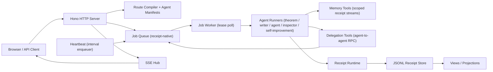
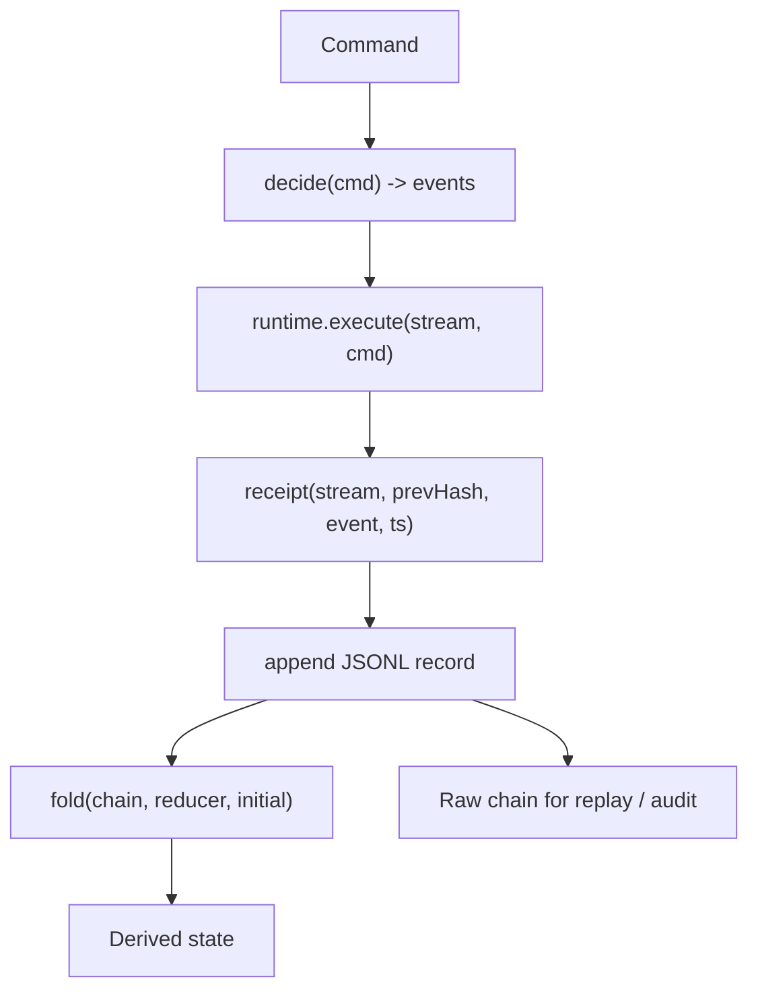
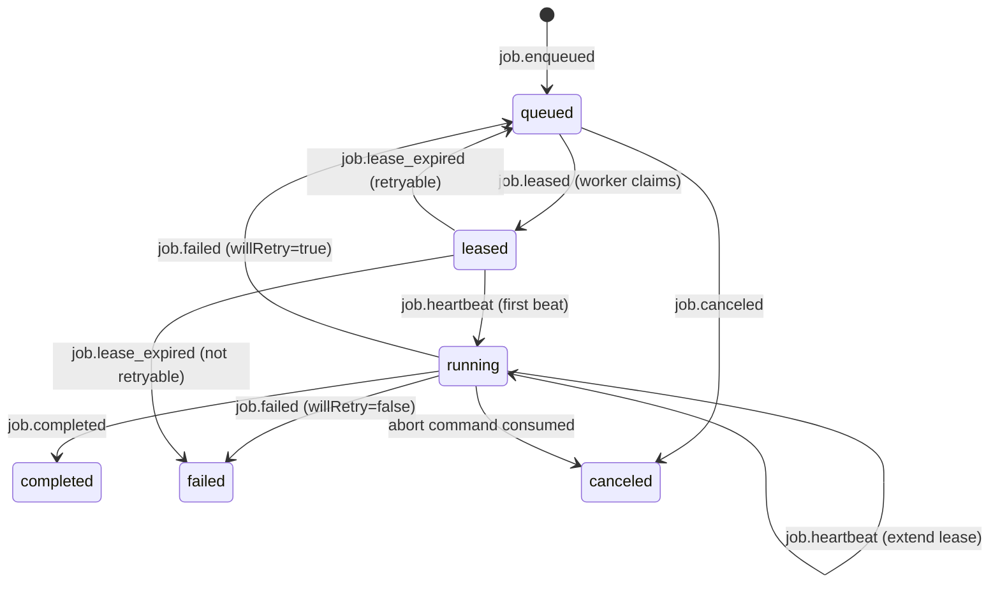
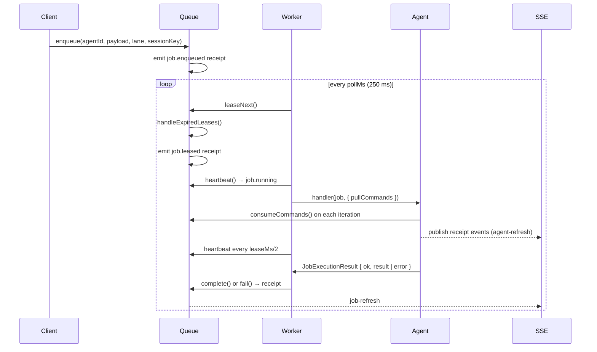
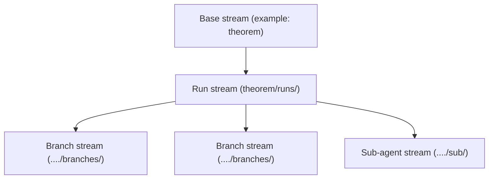

# Receipt Architecture

This document explains how the repo is structured and how requests move through the system.

## 1. High-level system

## 2. Core model

The architecture is receipt-native: every state change is an immutable, hash-linked record.

- Commands go into runtime `execute`.
- Domain `decide` maps commands to events.
- Events are appended as immutable, hash-linked receipts.
- Reducers fold receipts into current state.
- UI and APIs read from folded state and raw chains.

## 3. Queue model

The job queue is itself receipt-native — all queue state is derived by replaying `JobEvent`s through `src/modules/job.ts`. There is no separate queue database; the JSONL file **is** the queue.

### Job status lifecycle

A failed job re-enters `queued` if `attempt < maxAttempts` (max 8). Once in a terminal state (`completed | failed | canceled`) no further events are accepted — operations on terminal jobs are no-ops.

### Lanes and scheduling priority

Every job has a lane. `leaseNext` sorts candidates by lane priority before timestamp:

| Lane | Priority | Used for |
|---|---|---|
| `steer` | 0 (highest) | Urgent redirects sent by `singletonMode:"steer"` or `queueCommand("steer")` |
| `collect` | 1 (normal) | Standard agent jobs (default) |
| `follow_up` | 2 (lowest) | Continuation jobs queued after a primary finishes |

### Singleton modes

When a job is enqueued with a `sessionKey`, `singletonMode` controls what happens to existing active jobs on the same key:

| Mode | Behaviour |
|---|---|
| `allow` (default) | New job is always created alongside any existing jobs |
| `cancel` | All active jobs on the session key are aborted; new job is created |
| `steer` | The most-recent active job receives a `steer` command with the new payload; no new job is created |

### Lease and heartbeat mechanics

1. `leaseNext` atomically claims the top candidate, setting `leaseUntil = now + leaseMs` (default 30 s) and status `leased`.
2. The worker sends the first `heartbeat` immediately, which transitions the job to `running` and resets `leaseUntil`.
3. A `setInterval` fires every `leaseMs / 2` to keep renewing the lease while the agent runs.
4. On the next `leaseNext` call, `handleExpiredLeases` scans all `leased`/`running` jobs — any whose `leaseUntil` has passed emits `job.lease_expired`, returning the job to `queued` for retry (or `failed` if exhausted).

All of this is serialised through a `withLock` promise-chain so concurrent calls cannot interleave partial state.

### In-flight command system

While a job is running, external callers can push commands onto it via `queueCommand`:

| Command | Lane | Effect |
|---|---|---|
| `steer` | `steer` | Appended to `job.commands`; agent consumes via `pullCommands` and can redirect its problem |
| `follow_up` | `follow_up` | Appended to `job.commands`; agent picks it up as a continuation prompt |
| `abort` | `steer` | If job is `queued`, immediately cancels. If running, sets `abortRequested`; worker checks pre/post execution and cancels |

Commands are consumed (marked with `consumedAt`) atomically via `consumeCommands` so they are processed exactly once.

### Execution flow (worker perspective)

## 4. Stream topology

Each workflow keeps a small index stream plus per-run stream(s):

- Index stream stores run-level status and discovery receipts.
- Run stream stores run-local timeline.
- Branch streams store forked timelines for replay and compare.
- Sub-agent streams isolate delegated work and merge summaries back.

## 5. Agent orchestration patterns

### Theorem
- Round-based workflow with attempt, critique, patch, merge, verify phases.
- Branch-aware memory slicing (`src/agents/theorem.memory.ts`).
- Rebracketing logic chooses merge shape (`src/agents/theorem.rebracket.ts`).

### Writer
- Planner-driven dependency graph (`src/engine/runtime/planner.ts`).
- Step outputs are projected via state patches and final synthesis.

### Agent (generic ReAct)
- General-purpose Think/Act/Observe loop.
- Up to `maxIterations` cycles: pull live commands (`steer` / `follow_up`), build transcript from chain, call LLM, parse `{thought, action}` JSON, dispatch tool.
- Tool set: `ls`, `read`, `write`, `bash`, `grep`, memory tools, delegation tools, `skill.read`.
- Context management: soft trim (14 k chars), hard prune (50 k), compaction (20 k), overflow retry.
- Served through the `/monitor` Command Center SPA: job table, agent cards, activity feed, memory browser — all HTMX islands over SSE.

### Inspector
- Receipt analysis agent reading local JSONL artifacts and producing analysis receipts.

### Self-Improvement
- Proposal lifecycle: `created → validated → approved → applied` (or `reverted` from any state).
- Improvement harness gates `proposal.validated` via static checks (non-empty, size ≤ 120 k chars, path safety, JSON parse if applicable) then a subprocess (`IMPROVEMENT_HARNESS_CMD` / `IMPROVEMENT_VALIDATE_CMD`, 3 min timeout). Fails fast — subprocess is skipped if any static check fails.
- Heartbeat adapter autonomously enqueues scan jobs on `IMPROVEMENT_HEARTBEAT_MS`.
- REST API: `GET/POST /self-improvement/proposals`, `approve`, `apply`, `revert` per proposal.
- Artifact types: `"prompt_patch" | "policy_patch" | "harness_patch"`.

## 6. Cross-cutting infrastructure

### Memory tools
- Persistent, receipt-native scoped memory backed by `memory/<scope>` streams.
- Operations: `read`, `search` (keyword always; cosine-similarity semantic search when `embed` fn provided), `commit`, `summarize`, `diff`, `reindex`.
- Embeddings cached to disk as `.embeddings.json` per scope; reindex rebuilds the cache.
- Injected into every agent run; agents commit conclusions and retrieve relevant context each iteration.

### Delegation tools
- Async agent-to-agent RPC: `agent.delegate`, `agent.status`, `agent.inspect`.
- `agent.delegate` enqueues a job for any known agent and blocks (`waitForJob`) until it settles, returning the result text (clipped to 4 000 chars).
- `agent.status` polls `getJob(jobId)` for current status/result.
- `agent.inspect` reads a receipt chain file to let the caller observe another agent's event history.
- Delegated sub-jobs run in separate worker slots (async join) to prevent worker-slot deadlocks.

### Heartbeat
- `createHeartbeat(spec, deps)` returns `{ start, stop }`.
- Fires `deps.enqueue(...)` on `setInterval` at `spec.intervalMs`.
- On enqueue failure the interval is cleared immediately (fail-fast, no silent retry).

## 7. Reliability controls

- Stream-level locks in runtime prevent write races on the same stream.
- Event IDs support idempotent emit retries.
- Queue leases + heartbeats recover abandoned jobs — expired leases are detected on the next `leaseNext` call and the job re-enters `queued`.
- `withLock` in the queue serialises all mutations; state is always re-read from the receipt chain after each emit.
- Commands (`steer`, `follow_up`, `abort`) allow in-flight control of running agents without polling.
- Prompt/context compaction receipts capture overflow handling.
- Delegated sub-jobs use async join behavior to avoid worker-slot deadlocks.
- Memory tools are receipt-native — memory state is always derivable by replaying the chain; no separate DB needed.
- Improvement harness enforces a fail-fast gate before any proposal is marked `validated`; no fallback path bypasses it.
