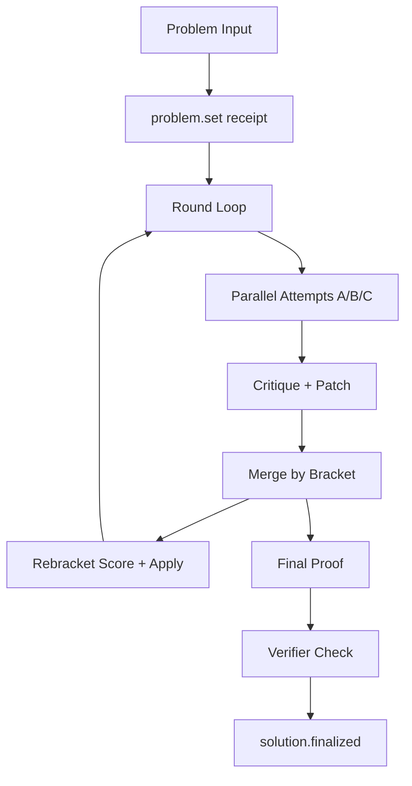
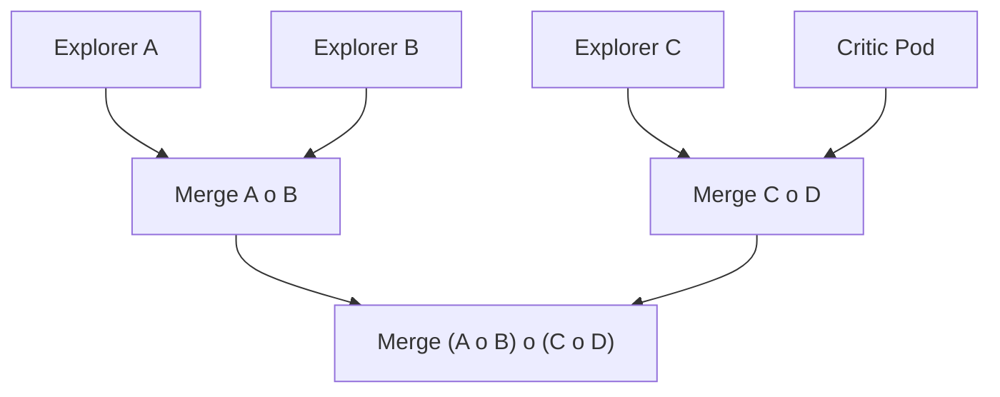

# Theorem Guild: How It Works

This document explains the Theorem Guild demo, how receipts drive everything, and how rebracketing changes collaboration order. Prompts, memory slices, and merge decisions are captured as receipts so the workflow stays explicit and auditable.

The system is intentionally minimal:
- Receipts are the only durable artifact.
- State and UI are pure folds over receipts.
- No hidden memory or mutable state.

Implementation layout (framework-style):
- `src/agents/theorem.ts`: workflow entry + public exports
- `src/agents/theorem.constants.ts`: team + examples + workflow ids
- `src/agents/theorem.streams.ts`: stream layout helpers (index/run/branch)
- `src/agents/theorem.memory.ts`: memory selection policy
- `src/agents/theorem.rebracket.ts`: rebracketing engine
- `src/agents/theorem.runs.ts`: run slicing + UI helpers

---

## Core loop (high level)

Mermaid flow:



---

## Receipts (events)

Every step emits a receipt:
- `problem.set`
- `run.configured`
- `run.status`
- `attempt.proposed`
- `lemma.proposed`
- `critique.raised`
- `patch.applied`
- `summary.made`
- `rebracket.applied`
- `solution.finalized`
- `verification.report`
- `memory.slice`
- `branch.created`

Parallel phases are explicit:
- `phase.parallel` (attempt / critique / patch)

All UI is derived from these receipts.

`run.configured` stores the workflow id/version, model, prompt hash, and run parameters (rounds/depth/memory/branch threshold) for reproducibility.

---

## What makes it multi-agent

- **Parallel roles**: explorers, critic, verifier, and synthesizer run in coordinated phases.
- **Branching streams**: divergent work forks into separate timelines and merges explicitly.
- **Merge policy**: rebracketing changes merge order based on critique evidence.
- **Auditable receipts**: memory slices and prompts are durable artifacts.

## Streams (index + run)

Receipts are partitioned by stream to keep runs isolated and replay fast.

- **Index stream**: `<base>` (ex: `theorem`) stores run-level receipts.
- **Run stream**: `<base>/runs/<runId>` stores the full chain for one run.
- **Branch stream**: `<runStream>/branches/<branchId>` stores forked timelines.

JSONL is one file per stream, so each run (and branch) gets its own JSONL file automatically.

---

## Memory (receipt-only)

Agents never use hidden memory.
Each prompt receives a **memory slice** built from receipts:
- last round's attempts / critiques / patches
- the latest summary

This is computed on demand by folding the chain.
Each slice also emits a `memory.slice` receipt with phase, size, and selected items.

---

## Rebracketing (causal)

Brackets are not decorative. They control merge order.
Conceptually this is a Tamari lattice over binary trees; each bracket is a merge lens that picks a composition order.

Example bracket:

```
((A o B) o (C o D))
```

Meaning:
1) Merge A + B
2) Merge C + D
3) Merge those two results

Each merge is a `summary.made` receipt tagged with its subtree bracket.

Mermaid for the merge tree:



The rebracket scorer uses evidence from receipts
(critiques, patches, summary links) to pick a better bracket for the next round.

Selection policy is deterministic:
- primary: maximize causal evidence score
- tie-break 1: prefer brackets with better parallel merge potential (more balanced internal composition)
- tie-break 2: prefer the current bracket when still tied (stability)
- tie-break 3: lexical order for final determinism

This keeps merge order aligned with category-style composition lenses while still favoring safe parallelism when evidence is equal.

---

## Branching (real)

Branches are real streams:
- one branch per agent is forked at the start of the run
- attempt / lemma / critique / patch receipts are routed to the agent’s branch
- the main stream keeps run-level receipts plus merged summaries and finals

This keeps agent timelines isolated while preserving a compact main stream for replay.

---

## Parallelism (explicit)

Attempts, critiques, and patches run in parallel.
Each parallel phase emits a `phase.parallel` receipt so the UI reflects it.

---

## Verification (heuristic)

We add a final verifier pass after the proof:
- emits `verification.report`
- updates metrics with `valid / needs / false`

This is still LLM-based, not formal proof.

---

## What makes it "the best"

The system gets better because:
- rebracketing changes **who merges first**
- memory is limited to **useful recent receipts**
- parallel work happens where safe
- verification provides a consistent “gap signal”

Still minimal. Still receipt-only. Everything is observable and replayable.
